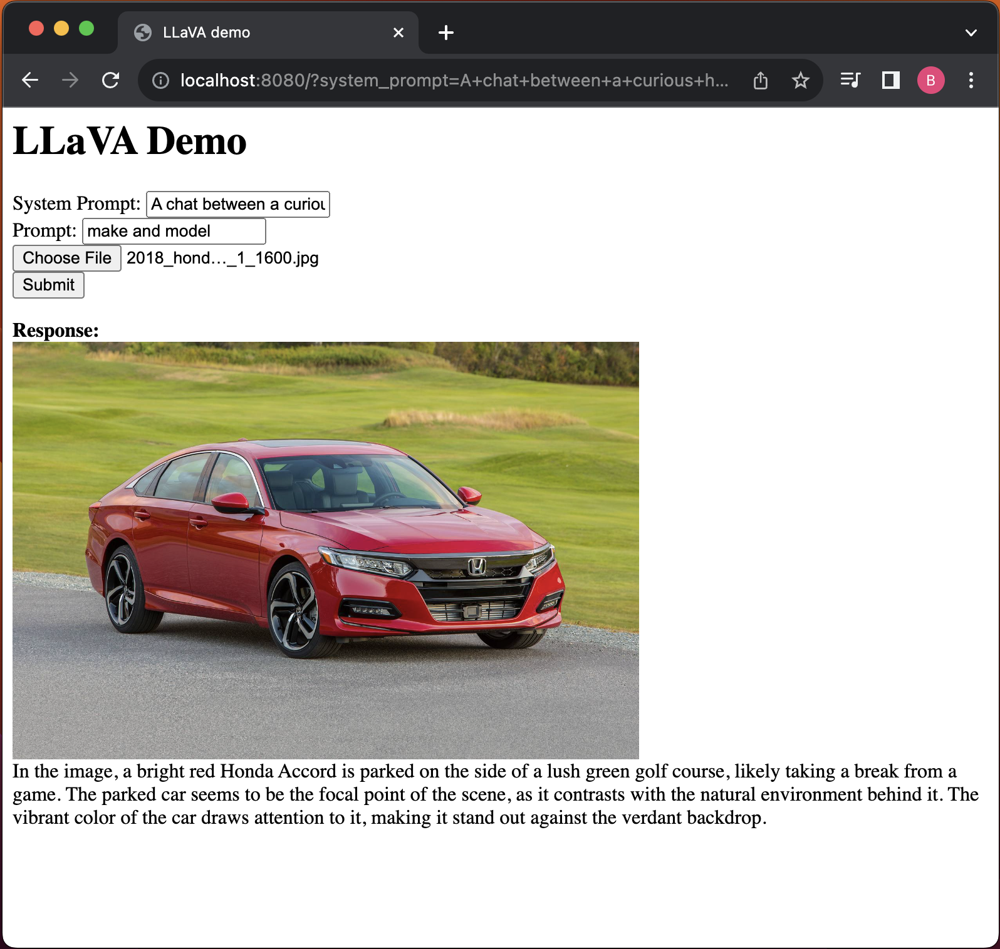

# LLaVA C++ Server
*Bart Trzynadlowski, 2023*

Simple API server for [llama.cpp](https://github.com/ggerganov/llama.cpp) implementation of LLaVA.

<p align="center">
  
</p>

## Usage

Download one of `ggml-model-*.gguf` and `mmproj-model-f16.gguf` from [here](https://huggingface.co/mys/ggml_llava-v1.5-13b/tree/main). Then, simply invoke:

```
bin/llava-server -m ggml-model-q5_k.gguf --mmproj mmproj-model-f16.gguf
```

This will start a server on `localhost:8080`. You can change the hostname and port with `--host` and `--port`, respectively, and enable HTTP logging with `--log-http`. You should be able to interact with the server at `localhost:8080` in a web browser.

## API

The LLaVA endpoint is at `/llava`. The request body takes the following parameters:

|Name|Type|Required|Description|
|----|----|--------|-----------|
|user_prompt|string|yes|The prompt (e.g., "what is this?")|
|image_file|file|yes|Image data in binary form.|
|system_prompt|string|no|System prompt.|

## Build Instructions

The [llama.cpp](https://github.com/ggerganov/llama.cpp) and [cpp-httplib](https://github.com/yhirose/cpp-httplib) repositories are included as gitmodules. After cloning, make sure to first run:

```
git submodule init
git submodule update
```

Then to build, simply run:

```
make
```

So far, this has only been tested on macOS, but should work anywhere else llama.cpp builds.

